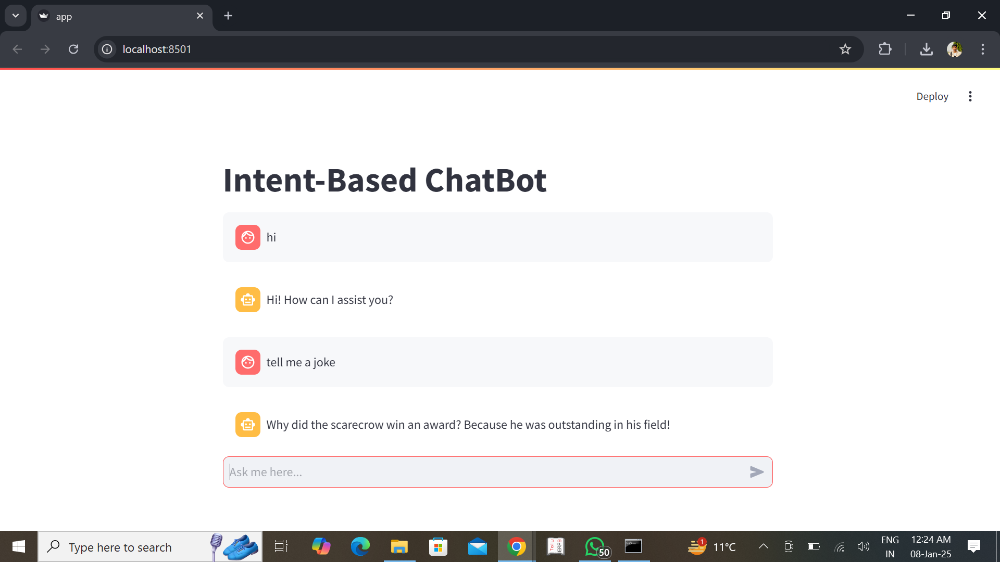

# Intent-Based Chatbot Using NLP



## Project Overview

This project implements an **Intent-Based Chatbot** using **Natural Language Processing (NLP)** techniques. The chatbot is designed to understand and respond to user inputs in a natural way by detecting intents and providing relevant responses. The interface is built using **Streamlit**, allowing real-time interaction with the chatbot. It uses a **Naive Bayes classifier** for intent detection and **TF-IDF vectorization** for converting text into numerical features.

---

## Learning Objectives

- Understand the basics of Intent-Based Chatbots and their applications.
- Learn how to process user inputs using NLP techniques such as tokenization, intent detection, and entity recognition.
- Build a chatbot using Python and deploy it with Streamlit.
- Manage chat sessions dynamically using Streamlit's session state.
- Enhance user experience with a clean and interactive interface.
- Apply machine learning techniques such as **Naive Bayes** for intent classification and **TF-IDF vectorization** for text representation.

---

## Tools and Technologies

- **Python**: The core programming language used to build the chatbot and NLP logic.
- **Natural Language Processing (NLP)**: Used for processing user inputs and detecting intents.
- **Streamlit**: A framework for building interactive web applications, used to deploy the chatbot interface.
- **Naive Bayes**: A machine learning algorithm used for intent classification.
- **TF-IDF Vectorizer**: A technique used for converting text into numerical features.
- **Session State (Streamlit)**: To maintain and manage chat history dynamically.
- **Cloud Platforms** (Future Deployment): Deployment on platforms like AWS or Heroku for public access.

---

## Features

- **Real-Time Interaction**: Chatbot can handle dynamic, real-time conversations.
- **Intent Detection**: Detects predefined user intents and responds accordingly.
- **Session Management**: Stores chat history to provide a continuous interaction flow.
- **User-Friendly Interface**: Simple, clean, and responsive chatbot interface built with Streamlit.
- **Machine Learning-Powered**: Utilizes Naive Bayes for intent classification and TF-IDF for text vectorization.
- **Future Enhancements**: Plans to integrate advanced NLP models (like BERT) and deploy the chatbot to cloud platforms.

---

## Installation

To run the chatbot locally, follow these steps (ensure Git is installed in your system to run Git commands):

1. Clone the repository:
   ```bash
   git clone https://github.com/Ayan16105/Intent_base_Chatbot.git


## Installation

To run the chatbot locally, follow these steps but before this ***Make Sure you had installed Git in your sytem to run git commands**:

1. Clone the repository:
   ```bash
   git clone https://github.com/Ayan16105/Intent_base_Chatbot.git
2. Change dirctory to your cloned Directory:
   ```bash
   cd Intent_base_Chatbot
3. Install required dependencies:
   ```bash
   pip install -r requirements.txt
4. Run the Streamlit app:
   ```bash
    streamlit run app.py
## Contributing
Feel free to fork the repository and submit pull requests. Contributions are welcome!
## License
This project is licensed under the MIT License - see the LICENSE file for details.
## Acknowledgments
- **Streamlit**: For providing an easy-to-use interface for deploying the chatbot.
- **NLP libraries**: For enabling text processing and intent recognition.
- **Open Source Community**: For sharing resources and tools that made this project possible.


   
   
